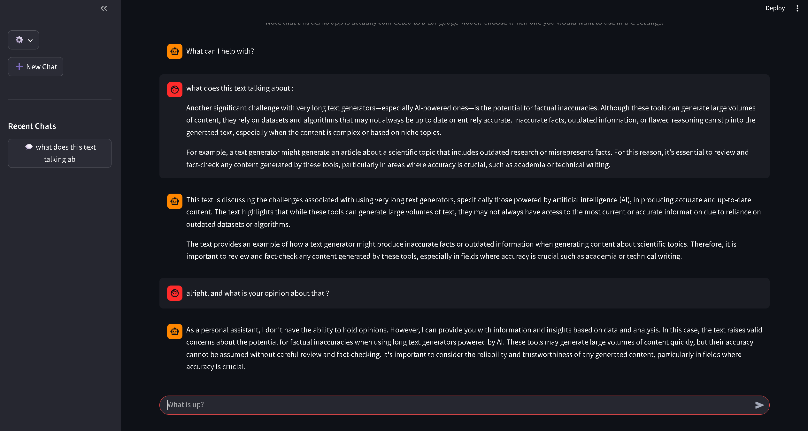

# Multi-Model Chatbot

This project is a ChatGPT-like web application built with Streamlit.  
It lets you chat with different language models through a unified interface, choose which model to use, and tweak generation parameters (temperature, top_p, max tokens) while seeing responses stream in real time.

---

## Features

- **Multi-model support** via a configurable `model_cfg.json` file  
- **Model selection in the UI** (choose the active model from a dropdown)
- **Live parameters control**: temperature, top_p, max_tokens
- **Chat interface** with conversation history and recent chats sidebar
- **Custom system prompt** loaded from `utils/system_prompt.txt`
- **Streaming responses** from the backend API client

---

## Project Structure

- `app.py` – Main Streamlit app (UI, sidebar, chat logic)
- `utils/api_client.py` – API client used to load models and stream responses
- `utils/model_cfg.json` – Configuration file describing available models (name, context length, purpose, etc.)
- `utils/system_prompt.txt` – System prompt injected at the beginning of each conversation

> Note: You can edit `model_cfg.json` and `system_prompt.txt` to adapt the chatbot to your own models and use cases.

---

## Installation

It is recommended to use a virtual environment (conda or `venv`).

```bash
# 1. Clone the repository
git clone https://github.com/yaghmo/chatbot.git
cd chatbot

# 2. Create a virtual environment (example with conda)
conda create -n chatbot_env python=3.10
conda activate chatbot_env

# 3. Install dependencies
pip install -r requirements.txt
```


## Available Models

| Model Name | Device | Speed |
|------------|------|------|
| `TheBloke/Mistral-7B-Instruct-v0.2-GGUF` | GPU but needs CPU | Fast
| `TheBloke/Mistral-7B-Instruct-v0.2-GGUF` | CPU | Slow
<!-- | `RedHatAI/Mistral-7B-Instruct-v0.3-GPTQ-4bit` | CPU |
| `RedHatAI/Mistral-7B-Instruct-v0.3-GPTQ-4bit` | GPU | -->


## Usage

After installing dependencies, Start the api server then launch the interface with:

```
python api_server.py
# wait 2-3 secs

streamlit run interface.py
```
or simply start the launcher, it will handle both files.

```
python launch.py
```

A web application will open where you can interact with models you select from settings, the cahtbot will then answer the user back.

## Examples


